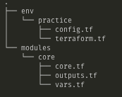

This is a log of work sessions, lessons learned, ideas, and thoughts that come from practicing Kubernetes.  

## 1/16/2019  
- Picking up work on studying for the Linux Foundation Certified Kubernetes Application Developer test.  
- Have a few good resources for the test itself:  
  - [CKAD-exercises](https://github.com/dgkanatsios/CKAD-exercises)
  - [ckad-prep-notes](https://github.com/twajr/ckad-prep-notes)
- And for learning Kubernetes generally, Kubernetes in Action is great.  
- First task to get a k8 cluster ready to go for this "studio" space.  
- I'm going to start by doing this on AWS, though the DevOps / K8 community seems to strongly prefer using GCE's managed k8 service, which makes sense since Google originally created kubernetes.  Also apparently a headache is in doing full cluster upgrades, and Google alleviates this.  
- As per the Linux Foundation course for the CKAD, will setup a 2 node cluster.  Unlike the class, I'll take the time to implement in a way that makes sense to me (using infrastructure-as-code) and general DevOps principles.  The course has scripts which would be manually run on the nodes/servers.  
- One challenge for the exam, I think, will be using VIM as my text editor, rather than visual studio code.  So for this try to use only the command line, if possible.  
- vim note, which is helpful for getting back into the work logs `GA` will bring the cursor to the end of the file and enter append mode.  
- **2-Node AWS Cluster**  
  - Already a [Terraform module](https://registry.terraform.io/modules/terraform-aws-modules/eks/aws/2.1.0) to provision EKS resources.
  Module assumes VPC and Subnets are setup already.  
  - **VPC + Subnets**  
    - Terraform directorty structure to follow module pattern, based on this talk by Nicki Watt:  [Evolving Your Infrastructure with Terraform](https://www.youtube.com/watch?v=wgzgVm7Sqlk)
    - 
    - Scaffold core terraform module, commit (a5e520f).

**Next Steps**  
- Learn what networking EKS will require
- Implement it in the core module, deploy to AWS
- Use the EKS Terraform module above to provision the 2-node cluster